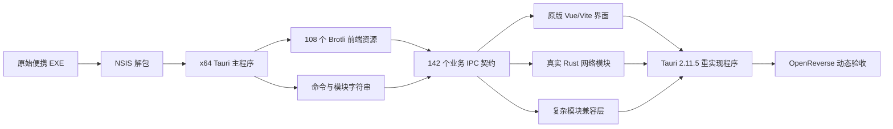

# 网络测试工具箱 9.0 逆向与重实现报告

> 分析日期：2026-09-02  
> 报告类型：普通 PE/Tauri 逆向，`flavor = null`  
> 分析目标：恢复界面、IPC 契约与可独立构建的 Windows 实现

## 1. 执行摘要

目标文件是 NSIS 3.11 Unicode 便携封装，内部主程序为 x64 Rust/Tauri 桌面应用。分析从主程序中恢复了 108 个 Brotli 压缩前端资源，并从 36 个 JavaScript 模块中整理出 142 个业务 IPC 命令。独立 Tauri 2.11.5 工程已经能够运行原版界面，OpenReverse 动态枚举到 189 个页面控件，IPC 注册覆盖率为 142/142。网络基础模块已经重新实现，复杂服务模块目前保留结构化兼容入口；因此当前成果是可运行的阶段版本，不能将其描述为全部业务行为已达到 100% 等价。最终输出包含 11,755,008 bytes 的目录便携主程序及 70,629,418 bytes 的 NSIS 单文件封装。

## 2. 范围与目标

授权与边界见 [scope.md](scope.md)。本次只分析用户明确提供的本机文件，不修改原始 EXE，不对第三方目标发起扫描，也不研究许可证服务绕过。

| 属性 | 值 |
|---|---|
| 外层文件 | `网络测试工具箱_9.0.0_x64_免安装运行便携.exe` |
| 外层大小 | 73,505,557 bytes |
| 外层 SHA-256 | `45273CE50E0AD03861314387A9BE67D79C27AE636EAE212A67C810B34D11F3FD` |
| 内层主程序 | `网络测试工具箱.exe` |
| 内层大小 | 24,212,480 bytes |
| 内层 SHA-256 | `D0488C6074A4B7B789DA5D15FA6163325185CB42075CC6BF6E413B1CF5713AFA` |
| 架构 | x86-64 PE |
| 应用栈 | Rust、Tauri 2.11.5、runtime-wry 2.11.4、Vue/Vite |

## 3. 静态分析

外层是 32 位 NSIS 启动器，overlay 从约 `0x9200` 开始；解包后得到主程序、`ffmpeg.exe`、`hwmonitor.exe`、许可说明和图标。外层导入以安装/启动能力为主，包括 `ADVAPI32`、`SHELL32`、`ole32`、`COMCTL32`、`USER32`、`GDI32` 和 `KERNEL32`。内层主程序导入 `WS2_32`、`IPHLPAPI`、`SETUPAPI`、`PDH` 等 Windows 网络与性能 API，且没有 CLR 头，符合原生 Rust/Tauri 程序特征。

二进制字符串还保留了 `src\\commands\\*.rs` 与 `src\\modules\\network\\*.rs` 路径，可确认原后端按 ping、port scan、dashboard、camera、subnet、terminal 等模块组织。Tauri 资源表使用 Brotli 数据，恢复脚本最终提取 108 个资源，其中含 35 个主要页面视图。

## 4. 动态分析

OpenReverse UIA Host 对原程序主机发现页识别到 200 个节点，并读取到 10.0.60.0/24、254 个地址、27 台在线等页面状态。为避免干扰用户现场，保存控件树后停止对原程序执行 UIA 动作，并保留原程序可见运行。

重实现程序启动后，首次过早枚举只有 15 个系统节点；待 WebView 渲染完成后复测得到 151 个节点。窗口截图确认原版侧栏、Ping 五种模式、状态卡和图表区域均已加载。

## 5. 重实现架构



真实模块包括仪表盘、连通性、Ping、TCP Ping、批量 Ping、端口扫描、路由追踪、IPv4/IPv6 子网、VLSM、路由汇总、活动路由、网卡/IP、MAC/ARP、Wi-Fi 基础枚举、DNS/NSLookup、TCP 连通测试、连接统计与端口进程映射。摄像头、抓包、DHCP/LLDP、串口、远程终端、服务端工具、日志/安全检查、链路监控及 AI 助手仍处于兼容层。

## 6. Evidence

### E-001

- `title`：原始便携包固定性
- `observed_at`：2026-09-02
- `source_type`：file
- `source_ref`：用户提供的下载文件
- `content_hash`：`45273CE50E0AD03861314387A9BE67D79C27AE636EAE212A67C810B34D11F3FD`
- `artifact_path`：n/a（原文件位于项目外且未复制）
- `repro_command`：`Get-FileHash -Algorithm SHA256 -LiteralPath 'C:\Users\acer\Downloads\网络测试工具箱_9.0.0_x64_免安装运行便携.exe'`
- `raw_excerpt`：长度 73,505,557 bytes
- `linked_workitem`：n/a
- `supersedes`：none

### E-002

- `title`：NSIS 内容解包
- `observed_at`：2026-09-02
- `source_type`：command
- `source_ref`：`analysis/original-extracted/`
- `content_hash`：内层主程序 `D0488C6074A4B7B789DA5D15FA6163325185CB42075CC6BF6E413B1CF5713AFA`
- `artifact_path`：`analysis/original-extracted/$LOCALAPPDATA/yunweizatan/network-toolkit-9.0.0/网络测试工具箱.exe`
- `repro_command`：`D:\ApkEditor\7z.exe x -y -oanalysis\original-extracted '<目标 EXE>'`
- `raw_excerpt`：主程序、ffmpeg、hwmonitor、FFMPEG-NOTICE、resources/icon.ico
- `linked_workitem`：n/a
- `supersedes`：none

### E-003

- `title`：Tauri 资源恢复
- `observed_at`：2026-09-02
- `source_type`：command
- `source_ref`：`analysis/extract_tauri_assets.py`
- `content_hash`：见 `analysis/tauri-assets/manifest.json`
- `artifact_path`：`analysis/tauri-assets/`
- `repro_command`：`python analysis\extract_tauri_assets.py 'analysis\original-extracted\$LOCALAPPDATA\yunweizatan\network-toolkit-9.0.0\网络测试工具箱.exe' analysis\tauri-assets`
- `raw_excerpt`：`extracted 108 assets`
- `linked_workitem`：n/a
- `supersedes`：none

### E-004

- `title`：前端 IPC 契约目录
- `observed_at`：2026-09-02
- `source_type`：file
- `source_ref`：`analysis/frontend-ipc.json`
- `content_hash`：`FFFD1C3D48759AE2534D545840F20F32F0C027178EE895A1FEF84AF3B9675DEE`
- `artifact_path`：`analysis/frontend-ipc.json`
- `repro_command`：`python analysis\catalog_frontend_ipc.py`
- `raw_excerpt`：36 个模块、238 个调用点、142 个去重业务命令
- `linked_workitem`：n/a
- `supersedes`：none

### E-005

- `title`：原版 UIA 控件树
- `observed_at`：2026-09-02
- `source_type`：file
- `source_ref`：`analysis/openreverse/host-discovery-controls.json`
- `content_hash`：`5BED2124C9D1446550017F607CB11AA0968A37D79FD8496D6E126281FA7E2EA6`
- `artifact_path`：`analysis/openreverse/host-discovery-controls.json`
- `repro_command`：`pwsh -File analysis\openreverse_uia.ps1 -Action enumerate_controls -OutputPath analysis\openreverse\host-discovery-controls.json -TargetPid <原程序 PID>`
- `raw_excerpt`：200 个控件节点
- `linked_workitem`：n/a
- `supersedes`：none

### E-006

- `title`：重实现界面动态验收
- `observed_at`：2026-09-02
- `source_type`：screenshot
- `source_ref`：`analysis/openreverse/release-final-window.png`、`analysis/openreverse/release-ping-controls.json`
- `content_hash`：截图 `1D6AE77228BD5250459C51B4CAC768A7E776CFF773F8B7AAE0B0906613E2F40F`；控件树 `2A1E0D7D3301AC671FF3E089215D70F059D89D676844C3C572E17FCEEB0D702B`
- `artifact_path`：`analysis/openreverse/release-final-window.png`、`analysis/openreverse/release-ping-controls.json`
- `repro_command`：`pwsh -File analysis\capture_window.ps1 -TargetPid <重实现 PID> -OutputPath analysis\openreverse\release-final-window.png`
- `raw_excerpt`：OpenReverse 发布版枚举 189 个页面节点；截图显示 CPU、内存、磁盘与网络链路数据
- `linked_workitem`：n/a
- `supersedes`：none

### E-007

- `title`：IPC 与算法测试
- `observed_at`：2026-09-02
- `source_type`：command
- `source_ref`：`tests/check_ipc_coverage.py`、`src-tauri/src/subnet.rs`
- `content_hash`：n/a
- `artifact_path`：n/a
- `repro_command`：`python tests\check_ipc_coverage.py; Set-Location src-tauri; cargo +1.98.0 test subnet::tests`
- `raw_excerpt`：IPC 142/142；3 passed、0 failed
- `linked_workitem`：n/a
- `supersedes`：none

### E-008

- `title`：最终发布产物
- `observed_at`：2026-09-02
- `source_type`：file
- `source_ref`：`dist/` 与 `dist-portable/`
- `content_hash`：目录版主程序 `6EDC910BEAC7539BF370DFC63B43C257B2E8DADBDFFEC030748CE023CFC86A2D`；单文件封装 `BF23B1AB73EE83BCF67A7088A234AF2B9B1149F64048696394FCC94DFDC99870`
- `artifact_path`：`dist-portable/网络测试工具箱_9.0.0_x64_重实现便携.exe`、`dist/网络测试工具箱_9.0.0_x64_重实现_单文件.exe`
- `repro_command`：`$env:RUSTUP_TOOLCHAIN='1.98.0-x86_64-pc-windows-msvc'; npx --yes @tauri-apps/cli@2.8.4 build --bundles nsis`
- `raw_excerpt`：NSIS 内含主程序、FFMPEG-NOTICE.txt、ffmpeg.exe、hwmonitor.exe
- `linked_workitem`：n/a
- `supersedes`：none

## 7. Findings

### F-001

- `title`：目标是 NSIS 封装的 Rust/Tauri 应用
- `severity`：n/a_re
- `category`：reverse_algo
- `status`：validated
- `evidence_ids`：E-001、E-002
- `location`：外层 overlay 与内层 PE
- `impact`：可以分离启动器、原生后端与内嵌前端进行独立恢复。
- `confidence`：high
- `repro_steps`：校验外层哈希并用 7-Zip 解包包内容。
- `remediation`：n/a

### F-002

- `title`：原版前端可从 Tauri Brotli 资源表完整恢复
- `severity`：n/a_re
- `category`：reverse_algo
- `status`：validated
- `evidence_ids`：E-003、E-006
- `location`：内层主程序资源数据与 `analysis/tauri-assets/`
- `impact`：界面布局、样式、页面与前后端参数契约可以精确复用。
- `confidence`：high
- `repro_steps`：运行资源提取脚本，构建 Tauri 程序，再执行窗口截图和 UIA 枚举。
- `remediation`：n/a

### F-003

- `title`：业务 IPC 表面由 142 个去重命令组成
- `severity`：n/a_re
- `category`：reverse_algo
- `status`：validated
- `evidence_ids`：E-004、E-007
- `location`：36 个恢复的 JavaScript 模块与 `src-tauri/src/main.rs`
- `impact`：可以自动检查页面命令缺失，避免运行期因未注册命令直接失败。
- `confidence`：high
- `repro_steps`：重新生成 IPC 目录并运行覆盖检查脚本。
- `remediation`：n/a

### F-004

- `title`：当前版本尚未达到全部业务行为 100% 等价
- `severity`：n/a_re
- `category`：other
- `status`：validated
- `evidence_ids`：E-004、E-007
- `location`：`src-tauri/src/compat.rs`
- `impact`：复杂页面能够打开，但其兼容返回不能替代完整的抓包、串口、摄像头、远程终端和服务端协议实现。
- `confidence`：high
- `repro_steps`：对照 IPC 目录与 `compat.rs` 中的兼容命令。
- `remediation`：按页面契约逐组替换兼容命令，并为每组加入行为测试。

### F-005

- `title`：x64 目录版与 NSIS 单文件均可稳定产出
- `severity`：n/a_re
- `category`：other
- `status`：validated
- `evidence_ids`：E-006、E-008
- `location`：`dist/`、`dist-portable/`
- `impact`：用户可选择直接运行目录版，或使用与原目标相近的单文件自解压安装形态。
- `confidence`：high
- `repro_steps`：构建 release 与 NSIS，校验哈希并用 7-Zip 列出单文件内部内容。
- `remediation`：n/a

## 8. Path

### P-001

- `title`：从便携封装到可运行重实现
- `path_type`：callflow
- `start`：原始 NSIS 便携 EXE
- `goal`：独立可编译、可运行的 Tauri/Rust 工程
- `steps`：
  1. 解包 NSIS 并固定内层主程序 — evidence: E-001、E-002 — finding: F-001
  2. 定位并解压 Tauri Brotli 资源 — evidence: E-003 — finding: F-002
  3. 从页面模块提取 IPC 命令与参数上下文 — evidence: E-004 — finding: F-003
  4. 注册 142 个命令并重写网络基础模块 — evidence: E-007 — finding: F-003、F-004
  5. 启动程序并用 OpenReverse 验证界面 — evidence: E-006 — finding: F-002
  6. 生成目录版与 NSIS 单文件并校验内部资源 — evidence: E-008 — finding: F-005
- `residual_risks`：复杂协议与硬件相关模块尚缺行为等价验证；外部服务可能受网络、管理员权限、Npcap 和设备环境影响。

## 9. 复现与附件

```powershell
cd I:\learn_code\network-toolbox-900-rebuild
python .\analysis\catalog_frontend_ipc.py
python .\tests\check_ipc_coverage.py
cd .\src-tauri
cargo +1.98.0 test subnet::tests
cargo +1.98.0 run
```

关键附件包括 `analysis/interesting-strings.json`、`analysis/frontend-ipc-contexts.json`、`analysis/openreverse/`、`src-tauri/src/` 和 [timeline.md](timeline.md)。IDA MCP 未能在本机 IDA 8.3 环境启动，因此函数级反编译证据有限；本报告的主要结论由封装提取、资源恢复、字符串/前端契约与 OpenReverse 动态验收交叉支持。
